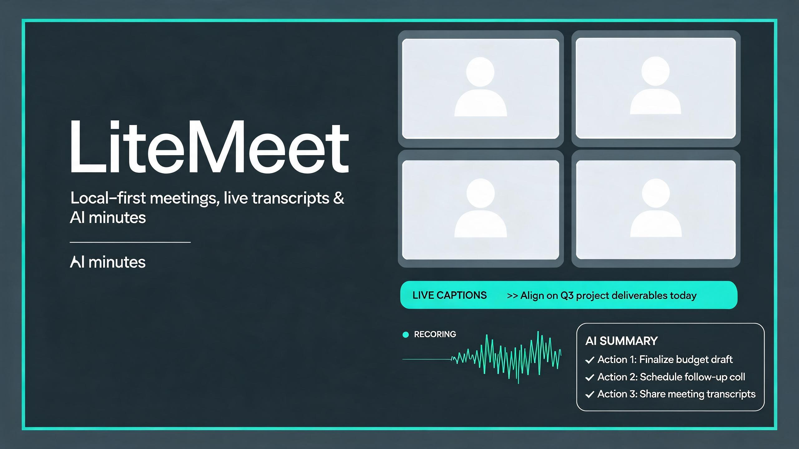
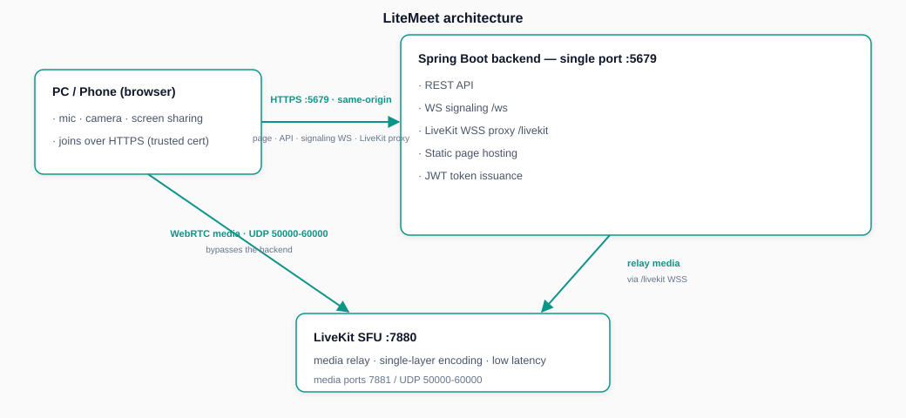

<div align="center">



# LiteMeet 轻会议

[](https://vuejs.org/)
[](https://spring.io/projects/spring-boot)
[](https://adoptium.net)
[](https://livekit.io/)
[](LICENSE)

**English** | [简体中文](README.zh-CN.md)

A **local-first** multi-party video conference and smart meeting-minutes tool. No account, no public server — all meeting data stays on your machine. LAN computers / phones join over HTTPS without CORS issues, using microphone, camera, screen sharing, and real-time captions.

</div>

## Features

- **Multi-party audio/video conferencing**: SFU (LiveKit) architecture, up to 50 participants per room, HD encoding (camera 2.5Mbps / 30fps)
- **Screen sharing**: with system audio, adaptive multi-device layout, fill / fit toggle and fullscreen
- **Meeting recording**: two modes — audio-only recording / screen recording (video + mixed audio), auto-saved locally after the meeting and uploaded to the server for playback / download
- **Real-time transcription captions**: transcribe while you speak, generating a full transcript (served by the local Whisper transcription service; models / keys are configured in the server manager "Key Management" and "Transcription Service" pages)
- **AI meeting minutes**: one-click structured minutes after the meeting (key points, decisions, action items) (LLM service is configured in the browser "Settings" page and stored in the browser locally, never on the server)
- **Recording management**: recordings / screenshots / transcripts / minutes managed in one place, owner device visible
- **Privacy & security**: data stays on your machine, pure LAN direct connection, no public network dependency

## Architecture

| Layer | Technology | Notes |
| --- | --- | --- |
| Frontend | Vue 3 + Vite (multi-page app) + livekit-client (vendored UMD) | Build output `frontend/dist/`, served by the backend / frontend server |
| Backend | Spring Boot 3.3 (Java 21) | REST API + WebSocket signaling + LiveKit WSS proxy + static file hosting |
| Media | LiveKit SFU server (`livekit/livekit-server.exe`) | Multi-party audio/video relay, single-layer encoding, low latency |
| Storage | MySQL + Redis + local directory | Meeting lifecycle / recordings / transcripts / minutes / transcription config (MySQL), ended-room code TTL (Redis), recording & video files / certs (`data/`), LLM config (browser local) |
| Frontend server | `tools/FrontendServer.java` (single-file JDK 21) | Optional standalone static server (HTTP 3000 / HTTPS 3001) |



## Directory Structure

```
meeting-tools/
├── backend/                 Spring Boot backend (Java 21 / Maven)
│   └── src/main/java/com/litemeet/backend/
│       ├── ai/              Transcription / summary AI client
│       ├── api/             REST: meeting records, sharing, system config
│       ├── config/          Static hosting, CORS, HTTPS certs, WebSocket registration
│       ├── livekit/         JWT issuance, LiveKit WSS proxy
│       ├── signaling/       WebSocket meeting signaling
│       └── store/           MySQL / JSON storage and caches
├── frontend/                Frontend (Vue 3 + Vite, multi-page app, source)
│   ├── src/
│   │   ├── App.vue          Home (create / join meeting, history, auto-dash meeting codes)
│   │   ├── components/      Shared components (AppTopbar, etc.)
│   │   ├── pages/           Per-page components
│   │   │   ├── room/        Meeting room (Room.vue + roomMedia.js)
│   │   │   ├── records/     Meeting record list
│   │   │   ├── record/      Record detail (play / download / transcribe / minutes)
│   │   │   └── settings/    Transcription & AI summary config (AI summary config stored in browser local)
│   │   └── utils/common.js  Common utils (API, formatting, identity)
│   ├── public/              Static assets (css/js/vendor/livekit-client UMD)
│   ├── index.html / room.html / records.html / record.html / settings.html  entry pages
│   ├── vite.config.js       Multi-page app build config
│   └── dist/                Build output (run `npm run build` manually, not committed)
├── livekit/                 LiveKit server (livekit-server.exe + livekit.yaml)
├── transcribe-server/       Local transcription gateway (Python stdlib, port 8300, drives the whisper-server engine)
├── Release/                 whisper.cpp local build output (whisper-server.exe etc., not committed; download via the env-management page)
├── tools/FrontendServer.java  Optional local frontend static server
├── server-manager/          Server manager (Python GUI: start/stop services, auto environment download, meeting monitoring, logs)
├── data/                    Runtime data (recordings / videos / certs / records / config)
├── start.bat                Launch the server manager
└── README.md
```

## Prerequisites

- **Windows** (target deployment is a LAN)
- **Python 3.10+** (only for the server-manager route, includes tkinter)
- **JDK 21+** (backend and frontend server; download from [Adoptium](https://adoptium.net))
- **Maven 3.6+** (only for the first backend build; the manager auto-builds on one-click start)
- **Node.js 18+ & npm** (building the Vue frontend; run `npm install` before first run — the manager auto-installs deps and starts in dev mode)
- **MySQL 8**: `127.0.0.1:3306`, user `root` / password `root` (database `litemeet` is auto-created, see `application.yml`)
- **Redis**: `127.0.0.1:6379`
- **LiveKit**: download the binary to `livekit/` yourself (see "LiveKit binary" below)
- **Firewall**: open TCP `7880`/`7881`, UDP `50000-60000` (media), TCP `5678`/`5679`/`3000`/`3001` (services)

> Except for Windows / Python, everything can be auto-downloaded via the server manager "Environment" page; point it at existing local installs by setting the path.

## Quick Start

### Option 1: Server Manager (recommended, no pre-installed environment needed)

After cloning, only Python is required; the manager auto-downloads everything else (JDK / Maven / Node.js / MySQL / Redis / LiveKit):

1. **Start the manager**: double-click `start.bat` in the root (requires [Python 3.10+](https://www.python.org/downloads/), check tkinter during install)
2. **Install environments**: go to the "Environment" page and click "Download & install" for missing components (installed under `server-manager\envs`, no system pollution); for already-installed components click "Set local path" to point at them
3. **One-click start**: go back to "Home" and click "One-click start" — it starts MySQL → Redis → LiveKit → backend → frontend → transcription service in dependency order; on first start it auto-runs the Maven backend build, npm frontend install, and initializes MySQL (root password set to `root`)
4. Open `http://localhost:5173` to use it

> **Transcription service (real-time captions)**: the transcription gateway (port 8300) starts automatically with one-click start. On first use, download the **Whisper Server** engine on the "Environment" page (or manually place whisper.cpp build output in `Release/`), then download a model (e.g. `small`) on the "Transcription Service" page and set it active. Enable "Recording" in a meeting room for real-time captions; access keys are generated on the "Key Management" page.

> The manager runs the frontend in **Vite dev mode** (hot reload): edit any source under `frontend/src` and the browser updates instantly. API and signaling WebSocket are proxied by Vite to the backend (5678); LAN devices can also visit `http://<host-ip>:5173` (but HTTP is not a secure context, so phone browsers cannot access microphone/camera). For full audio/video on phones, build and deploy with Option 2 (HTTPS 5679).

### Option 2: Manual CLI deployment (for LAN HTTPS access)

1. **Install the LiveKit binary**: download the Windows build (`livekit-server.exe`) from the official LiveKit [Releases](https://github.com/livekit/livekit/releases), unzip it into the project `livekit/` directory (next to `livekit.yaml`). The binary is large and not committed to Git; download it yourself.
2. **Configure the LAN IP**: edit `livekit/livekit.yaml`, change `rtc.node_ip` to your machine's WLAN IPv4 address (see `ipconfig`). Update this value after the WiFi IP is reassigned.
3. **Build and start** (run in order):

   ```bat
   cd backend && mvn -DskipTests package && cd ..
   cd frontend && npm install && npm run build && cd ..
   start "" livekit\livekit-server.exe --config livekit\livekit.yaml
   start "" java -jar backend\target\litemeet-backend.jar
   ```

4. **Local access**: `http://localhost:5679` (backend hosts dist on a single port, full features).
5. **LAN device access**: phones / other computers open `https://<host-ip>:5679` (e.g. `https://192.168.31.220:5679`); on first visit trust the self-signed cert via "Advanced → Proceed".

## Access Overview

| Scenario | URL | Notes |
| --- | --- | --- |
| Local | `http://localhost:3000` | Standalone frontend service, recommended locally |
| Local (single port) | `https://localhost:5679` | Backend-hosted pages, same-origin with API / signaling / media |
| LAN phone / PC | `https://<host-ip>:5679` | Single-port same-origin, trust the cert on first visit, full audio/video works |

> Single-port same-origin (5679) is what makes phones work: pages, API, signaling WebSocket and the LiveKit proxy are all same-origin, so a phone only needs to trust one cert to be in a secure context and use the microphone / camera.

## Configuration

- **`livekit/livekit.yaml`**: media port range, room capacity, API Key/Secret, `node_ip` (important, see Quick Start)
- **`backend/src/main/resources/application.yml`**: backend port (5678), HTTPS port (5679), MySQL / Redis connection, LiveKit key & address
- **`transcribe-server/config.json`**: transcription gateway key list / time-limited open windows / current model, maintained by the server manager "Key Management" / "Transcription Service" pages (model files in `transcribe-server/models/`)
- **Web "Settings" page**: transcription service config (Base URL / API Key / model / language, saved to MySQL `litemeet_settings`, service-level shared) and AI summary service config (Base URL / API Key / model, **saved in the browser only**, isolated per user)

## FAQ

- **Phone cannot use microphone / camera**: must use HTTPS (`https://<ip>:5679`) and trust the cert; also confirm the firewall opens the media ports.
- **Other devices cannot connect / no video**: confirm `livekit.yaml` `node_ip` is your current WLAN IPv4 and devices are on the same LAN subnet.
- **Changes don't appear after editing code**: the browser cached old JS; hard-refresh (`Ctrl+Shift+R` / `Ctrl+F5`).
- **Meeting code cannot be reused**: after a meeting is dissolved the code is kept for 1 day (`ended-room-ttl`) by default, then released automatically.
- **Backend restart impact**: a backend restart clears in-memory rooms and running meetings (during dev, frequent restarts may cause "become the creator" / "lost ownership" illusions — this is normal; recreate the meeting).

## Port Reference

| Port | Service |
| --- | --- |
| 5678 | Backend REST API (HTTP), Swagger: `/swagger-ui.html` |
| 5679 | Backend HTTPS (single-port same-origin, LAN device entry) |
| 3000 / 3001 | Standalone frontend service (HTTP / HTTPS) |
| 7880 | LiveKit signaling (WebSocket, proxied via backend `/livekit`) |
| 7881 / 50000-60000 | LiveKit media (TCP fallback / UDP) |
| 8300 | Local transcription gateway (Whisper-compatible API, `/v1/audio/transcriptions`) |
| 8301 | whisper-server engine (spawned on demand by the gateway) |

## Disclaimer

- This tool is provided **as is** for personal learning and research, without warranty of any kind. See the [LICENSE](LICENSE).
- Transcription captions and AI meeting minutes are generated by AI models and may contain errors. **Always review transcripts and minutes before distributing them.**
- Meeting data is stored on your machine and shared only over your LAN; do not hold meetings involving legally protected or sensitive content unless your environment is appropriately secured (e.g. trusted self-signed certs, controlled access keys).
- Users are responsible for complying with applicable laws and the rights of all participants when recording meetings; obtain consent where required.

## License

See the [LICENSE](LICENSE) file for details.

## Acknowledgements

- [LiveKit](https://livekit.io/) — SFU media server
- [Vue.js](https://vuejs.org/) · [Element Plus](https://element-plus.org/) · [Vite](https://vitejs.dev/) — frontend framework
- [Spring Boot](https://spring.io/projects/spring-boot) — backend framework
- [whisper.cpp](https://github.com/ggerganov/whisper.cpp) — local transcription engine
